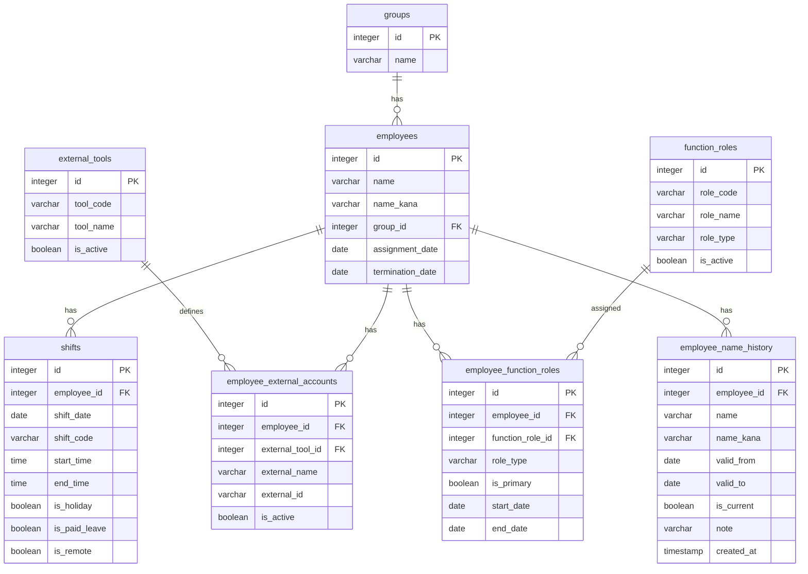

# my_database スキーマ定義書 v8

## 概要

シフト管理システム用のPostgreSQLデータベース。従業員、グループ、シフト情報に加え、機能役割（役職含む）・外部ツール連携を管理する。

## ER図



---

## テーブル一覧

| テーブル名 | 説明 | レコード数 |
|-----------|------|-----------|
| groups | グループマスタ | 3 |
| employees | 従業員マスタ | 176 |
| shifts | シフトデータ | 46,552 |
| function_roles | 機能役割マスタ（役職含む） | 5 |
| employee_function_roles | 従業員機能役割（役職含む） | 191 |
| employee_name_history | 従業員氏名履歴 | 171 |
| external_tools | 外部ツールマスタ | 0 |
| employee_external_accounts | 従業員外部アカウント | 0 |

---

## テーブル詳細

### 1. groups（グループマスタ）

従業員が所属するグループを管理する。

| カラム名 | データ型 | NULL | デフォルト | 説明 |
|---------|---------|------|-----------|------|
| id | integer | NO | auto_increment | 主キー |
| name | varchar(50) | NO | - | グループ名（ユニーク） |

**制約**: PK(id), UNIQUE(name)

---

### 2. employees（従業員マスタ）

従業員の基本情報を管理する。

| カラム名 | データ型 | NULL | デフォルト | 説明 |
|---------|---------|------|-----------|------|
| id | integer | NO | auto_increment | 主キー |
| name | varchar(100) | NO | - | 従業員名 |
| name_kana | varchar(100) | YES | - | 従業員名（カナ） |
| group_id | integer | YES | - | 所属グループID |
| assignment_date | date | YES | - | CSC配属日 |
| termination_date | date | YES | - | 退職日（在籍中はNULL） |

**制約**: PK(id), FK(group_id → groups.id)

**在籍者抽出クエリ例**:
```sql
-- 特定日時点の在籍者
SELECT * FROM employees
WHERE assignment_date <= :対象日
  AND (termination_date IS NULL OR termination_date >= :対象日)
```

---

### 3. shifts（シフトデータ）

従業員の日々のシフト情報を管理する。

| カラム名 | データ型 | NULL | デフォルト | 説明 |
|---------|---------|------|-----------|------|
| id | integer | NO | auto_increment | 主キー |
| employee_id | integer | YES | - | 従業員ID |
| shift_date | date | NO | - | シフト日付 |
| shift_code | varchar(20) | YES | - | シフトコード |
| start_time | time | YES | - | 開始時刻 |
| end_time | time | YES | - | 終了時刻 |
| is_holiday | boolean | YES | false | 休日フラグ |
| is_paid_leave | boolean | YES | false | 有給休暇フラグ |
| is_remote | boolean | NO | false | テレワークフラグ |

**制約**: PK(id), FK(employee_id → employees.id), UNIQUE(employee_id, shift_date)

**テレワーク集計クエリ例**:
```sql
-- 従業員別・勤務形態別の出勤日数
SELECT 
  e.name,
  g.name AS group_name,
  SUM(CASE WHEN s.is_remote = true THEN 1 ELSE 0 END) AS テレワーク日数,
  SUM(CASE WHEN s.is_remote = false THEN 1 ELSE 0 END) AS 出社日数
FROM shifts s
JOIN employees e ON s.employee_id = e.id
LEFT JOIN groups g ON e.group_id = g.id
WHERE s.start_time IS NOT NULL  -- 出勤日のみ
  AND s.shift_date BETWEEN :開始日 AND :終了日
GROUP BY e.id, e.name, g.name
ORDER BY g.id, e.id;
```

---

### 4. function_roles（機能役割マスタ）

機能役割（受付、二次対応、SVなど）および役職（副部長、課長など）を統合管理する。`role_type` により業務上の機能役割、監督権限、役職を分類する。

| カラム名 | データ型 | NULL | デフォルト | 説明 |
|---------|---------|------|-----------|------|
| id | integer | NO | auto_increment | 主キー |
| role_code | varchar(20) | NO | - | 役割コード（UKETSUKE / SV / KACHO等） |
| role_name | varchar(50) | NO | - | 役割名（受付 / SV / 課長等） |
| role_type | varchar(20) | NO | 'FUNCTION' | 役割分類（FUNCTION: 業務役割 / AUTHORITY: 監督権限 / POSITION: 役職） |
| is_active | boolean | YES | true | 有効フラグ |

**制約**: PK(id), UNIQUE(role_code)

**role_type の分類**:

| role_type | 説明 | 対象 |
|-----------|------|------|
| FUNCTION | 業務上の機能役割 | 受付、二次対応 |
| AUTHORITY | 監督権限 | SV |
| POSITION | 役職 | 副部長、課長 |

**制約の効果**: `employee_function_roles` 側のカテゴリ重複防止制約と連携し、同一カテゴリ（同一 `role_type`）の役割を同時に保持できないようにする。これにより「受付 + 二次対応」の同時保持は不可だが、「受付 + SV」や「受付 + 課長」の組み合わせは許可される。役職も同様に、同時に複数の役職を持つことはできない。

**現在のデータ**:
| id | role_code | role_name | role_type |
|----|-----------|-----------|-----------|
| 1 | UKETSUKE | 受付 | FUNCTION |
| 2 | NIJI | 二次対応 | FUNCTION |
| 3 | SV | SV | AUTHORITY |
| 4 | FUKUBUCHO | 副部長 | POSITION |
| 5 | KACHO | 課長 | POSITION |

---

### 5. employee_function_roles（従業員機能役割）

従業員と機能役割・役職の紐付けを管理する。履歴管理対応。`role_type` は `function_roles` からトリガーで自動設定される非正規化カラム。

| カラム名 | データ型 | NULL | デフォルト | 説明 |
|---------|---------|------|-----------|------|
| id | integer | NO | auto_increment | 主キー |
| employee_id | integer | YES | - | 従業員ID |
| function_role_id | integer | YES | - | 機能役割ID |
| role_type | varchar(20) | NO | 'FUNCTION' | 役割分類（function_rolesから自動設定） |
| is_primary | boolean | YES | false | 主担当フラグ |
| start_date | date | YES | - | 開始日 |
| end_date | date | YES | - | 終了日 |

**制約**:
- PK(id)
- FK(employee_id → employees.id)
- FK(function_role_id → function_roles.id)
- **部分ユニークインデックス①**: `(employee_id, function_role_id) WHERE end_date IS NULL` — 同一従業員で同一役割の現行レコードは1件のみ
- **部分ユニークインデックス②（カテゴリ重複防止）**: `(employee_id, role_type) WHERE end_date IS NULL` — 同一従業員で同一カテゴリ（role_type）の現行レコードは1件のみ

**カテゴリ重複防止制約の効果**:

| 操作 | 結果 | 理由 |
|------|------|------|
| 受付を持つ人に二次対応を追加 | **ブロック** | 両方 `role_type='FUNCTION'`、重複 |
| 受付を持つ人にSVを追加 | **許可** | `FUNCTION` + `AUTHORITY`、重複なし |
| 二次対応を持つ人にSVを追加 | **許可** | `FUNCTION` + `AUTHORITY`、重複なし |
| SVを持つ人にさらにSVを追加 | **ブロック** | `AUTHORITY` が重複 |
| 課長を持つ人に受付を追加 | **許可** | `POSITION` + `FUNCTION`、重複なし |
| 課長を持つ人にSVを追加 | **許可** | `POSITION` + `AUTHORITY`、重複なし |
| 課長を持つ人に副部長を追加 | **ブロック** | 両方 `role_type='POSITION'`、重複 |

**トリガー: role_type 自動設定**:

`employee_function_roles` への INSERT / UPDATE 時に、`function_roles.role_type` の値を自動的に `employee_function_roles.role_type` にコピーする。

```sql
CREATE OR REPLACE FUNCTION set_efr_role_type()
RETURNS TRIGGER AS $$
BEGIN
  SELECT role_type INTO NEW.role_type
  FROM function_roles
  WHERE id = NEW.function_role_id;
  RETURN NEW;
END;
$$ LANGUAGE plpgsql;

CREATE TRIGGER trg_efr_set_role_type
BEFORE INSERT OR UPDATE OF function_role_id
ON employee_function_roles
FOR EACH ROW
EXECUTE FUNCTION set_efr_role_type();
```

**SV一覧クエリ例**:
```sql
SELECT e.id, e.name, g.name AS group_name
FROM employees e
JOIN employee_function_roles efr ON e.id = efr.employee_id AND efr.end_date IS NULL
JOIN function_roles fr ON efr.function_role_id = fr.id
LEFT JOIN groups g ON e.group_id = g.id
WHERE fr.role_code = 'SV'
ORDER BY g.id, e.id
```

---

### 6. employee_name_history（従業員氏名履歴）

従業員の氏名変更履歴を管理する。改姓等の履歴管理対応。

| カラム名 | データ型 | NULL | デフォルト | 説明 |
|---------|---------|------|-----------|------|
| id | integer | NO | auto_increment | 主キー |
| employee_id | integer | YES | - | 従業員ID |
| name | varchar(100) | NO | - | 従業員名 |
| name_kana | varchar(100) | YES | - | 従業員名（カナ） |
| valid_from | date | NO | - | 有効開始日 |
| valid_to | date | YES | - | 有効終了日（現行はNULL） |
| is_current | boolean | YES | false | 現行氏名フラグ |
| note | varchar(255) | YES | - | 備考 |
| created_at | timestamp | YES | CURRENT_TIMESTAMP | 作成日時 |

**制約**:
- PK(id)
- FK(employee_id → employees.id)
- **部分ユニークインデックス**: (employee_id) WHERE is_current = true — 同一従業員で現行氏名は1件のみ
- **EXCLUDE制約**: `EXCLUDE USING GiST (employee_id WITH =, daterange(valid_from, valid_to, '[]') WITH &&)` — 同一従業員の有効期間の重複を禁止（btree_gist拡張が必要）

---

### 7. external_tools（外部ツールマスタ）

外部ツール（CTstage等）を管理する。

| カラム名 | データ型 | NULL | デフォルト | 説明 |
|---------|---------|------|-----------|------|
| id | integer | NO | auto_increment | 主キー |
| tool_code | varchar(50) | NO | - | ツールコード |
| tool_name | varchar(100) | NO | - | ツール名 |
| is_active | boolean | YES | true | 有効フラグ |

**制約**: PK(id)

---

### 8. employee_external_accounts（従業員外部アカウント）

従業員と外部ツールアカウントの紐付けを管理する。

| カラム名 | データ型 | NULL | デフォルト | 説明 |
|---------|---------|------|-----------|------|
| id | integer | NO | auto_increment | 主キー |
| employee_id | integer | YES | - | 従業員ID |
| external_tool_id | integer | YES | - | 外部ツールID |
| external_name | varchar(100) | NO | - | 外部ツール上の表示名 |
| external_id | varchar(100) | YES | - | 外部ツール上のID |
| is_active | boolean | YES | true | 有効フラグ |

**制約**: PK(id), FK(employee_id → employees.id), FK(external_tool_id → external_tools.id)

---

## リレーション

```
groups (1) ────< (N) employees (1) ────< (N) shifts
                         │
                         ├────< (N) employee_function_roles >────(N) function_roles
                         │
                         ├────< (N) employee_name_history
                         │
                         └────< (N) employee_external_accounts >────(N) external_tools
```

| 親テーブル | 子テーブル | 外部キー | 関係 |
|-----------|-----------|---------|------|
| groups | employees | group_id | 1:N |
| employees | shifts | employee_id | 1:N |
| employees | employee_function_roles | employee_id | 1:N |
| function_roles | employee_function_roles | function_role_id | 1:N |
| employees | employee_name_history | employee_id | 1:N |
| employees | employee_external_accounts | employee_id | 1:N |
| external_tools | employee_external_accounts | external_tool_id | 1:N |

---

## 変更履歴

| バージョン | 日付 | 変更内容 |
|-----------|------|----------|
| v1 | 2025-01-24 | 初版作成 |
| v2 | 2025-01-25 | positions, function_roles, employee_function_roles追加。employees.role_type1/2/3を廃止しis_sv, position_idに変更。employee_external_accountsにexternal_id追加 |
| v3 | 2026-01-27 | employees.hire_date, employees.termination_date追加（入社日・退職日管理） |
| v4 | 2026-01-27 | employees.hire_dateをassignment_dateにリネーム（CSC配属日に変更） |
| v5 | 2026-01-27 | shifts.is_remote追加（テレワークフラグ） |
| v6 | 2026-02-05 | employee_name_history（従業員氏名履歴）テーブルを追加。EXCLUDE制約による期間重複禁止を含む。テーブル一覧のレコード数を最新化 |
| v7 | 2026-02-07 | SV管理をfunction_rolesに統合。function_roles.role_type追加（FUNCTION/AUTHORITY分類）。employee_function_roles.role_type追加（非正規化）とカテゴリ重複防止制約。role_type自動設定トリガー追加。employees.is_svを削除 |
| v8 | 2026-02-16 | positionsマスターをfunction_rolesに統合。role_typeにPOSITION追加（FUNCTION/AUTHORITY/POSITIONの3分類）。employees.position_idを削除。positionsテーブルを廃止。employee_name_historyのカラムをemployeesと整合（name/name_kanaに統一） |
